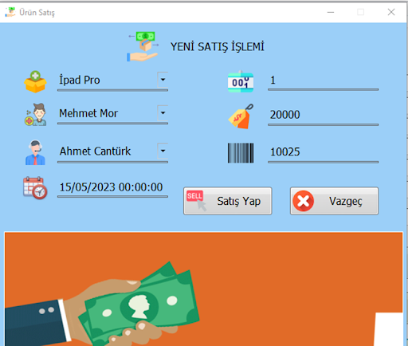
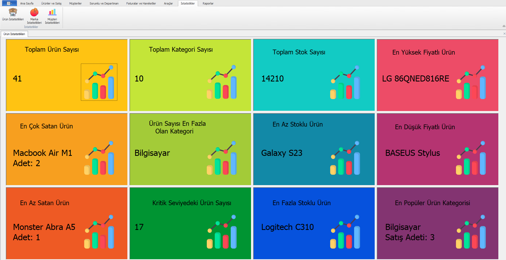
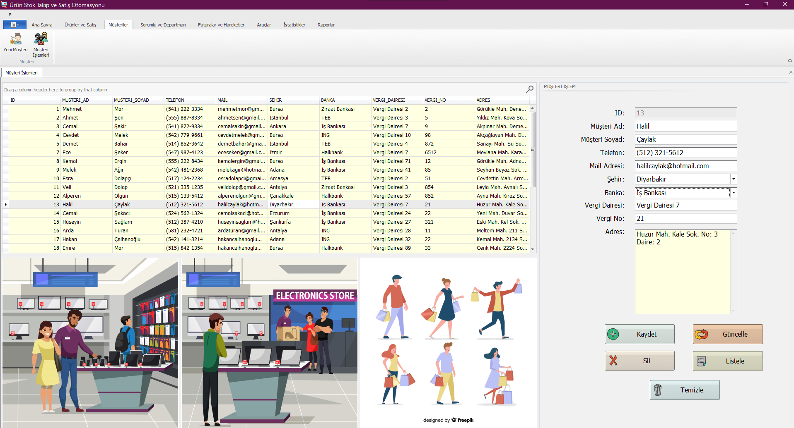
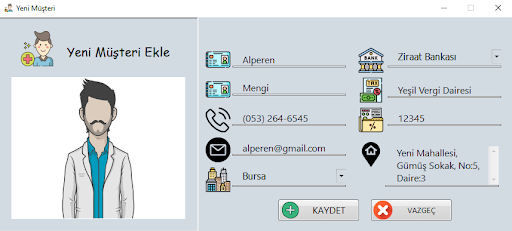
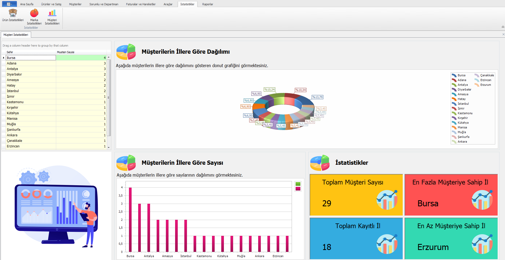
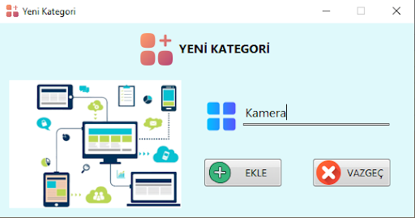
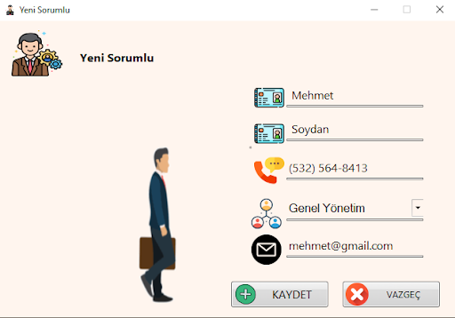
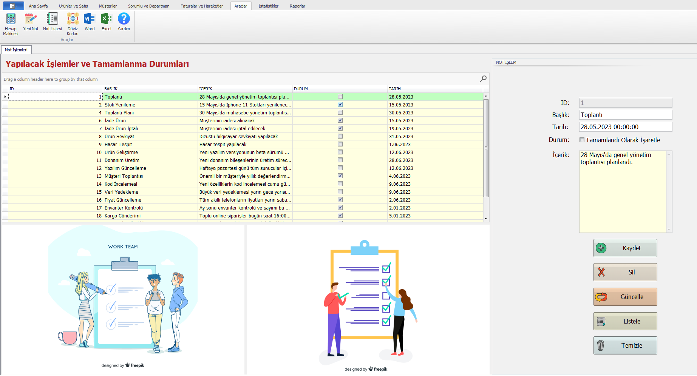
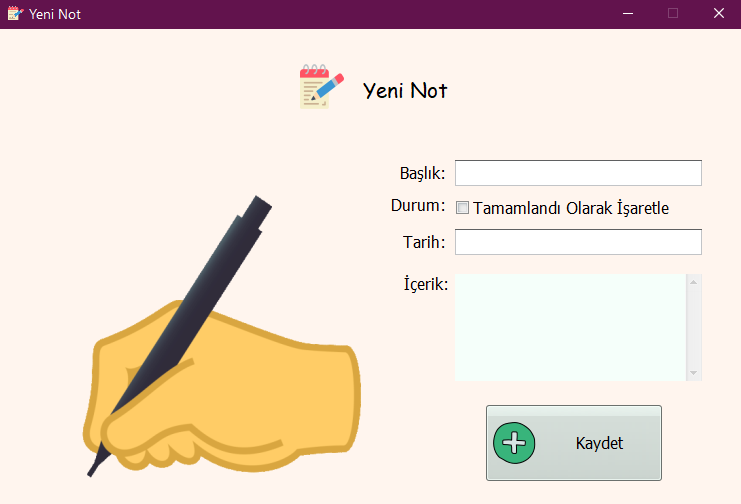
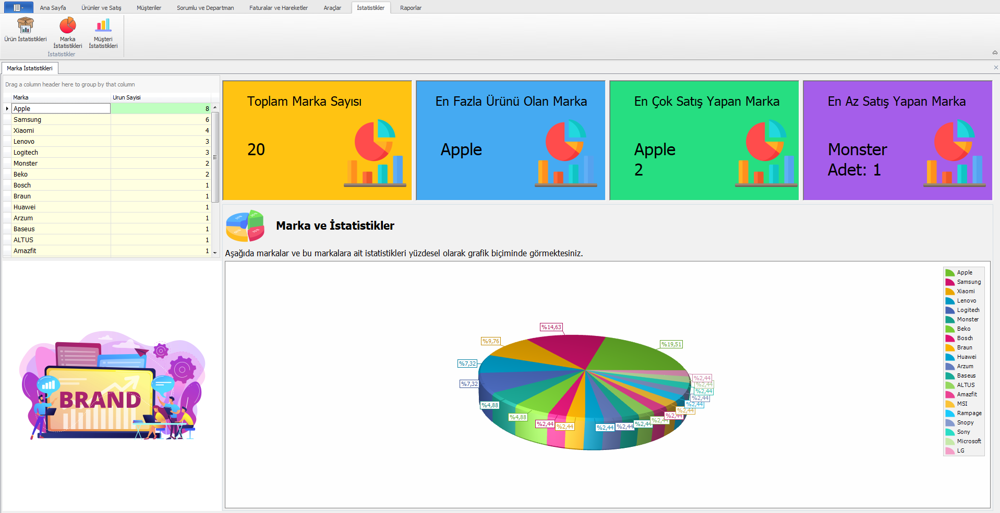

# Product Inventory Tracking and Management Application
 This application allows inventory management of the technology market (or any market), sales tracking, invoice creation, stock tracking, department management, employee management, various statistics in different areas, and many other features  
 

https://github.com/ozcanisik/Product-Inventory-Tracking-and-Management-Application/assets/118480025/6334a9ac-b06e-457e-8a8e-811984ebdb18

Technologies used in the project: Devexpress, Entity Framework(Database First Approach), C#, .NET, MS SQL

## Screenshots
Below you can see some screenshots of the app. If you would like to see the app in more detail, please watch the short video above.

### Login Panel

### Homepage

### Product Management

### Add Product

### Product Sale

### Product Statistics

### Customer Management

### Add Customer

### Customer Statistics

### Add Category

### Add Department

### Add Employee

### Note Management

### Add Note

### Brand Statistics

