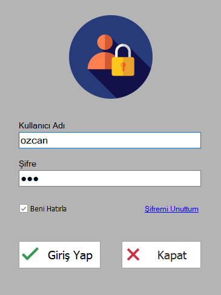
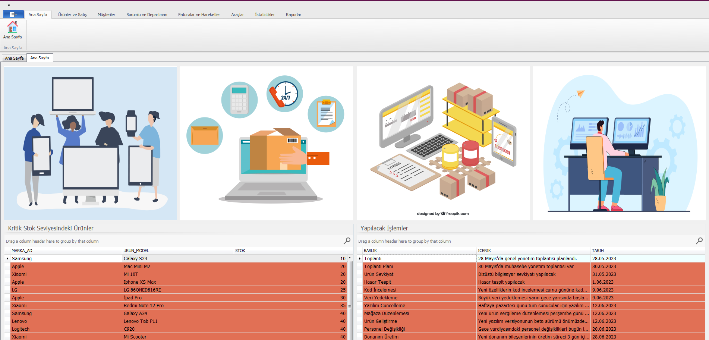
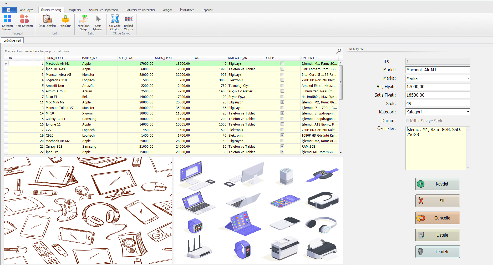
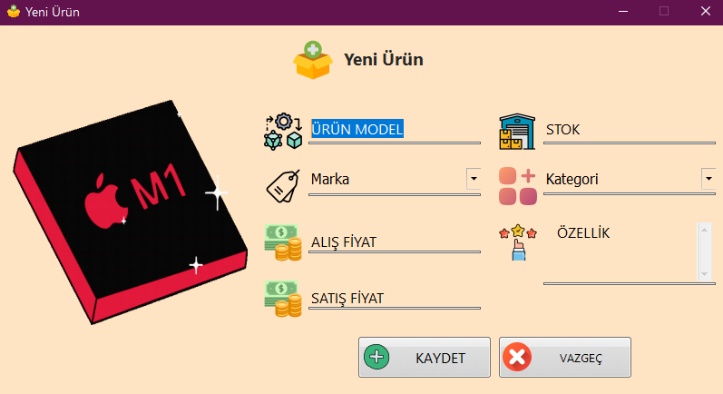

# Product Inventory Tracking and Management Application
 This application allows inventory management of the technology market (or any market), sales tracking, invoice creation, stock tracking, department management, employee management, various statistics in different areas, and many other features  
 

https://github.com/ozcanisik/Product-Inventory-Tracking-and-Management-Application/assets/118480025/6334a9ac-b06e-457e-8a8e-811984ebdb18

Technologies used in the project: Devexpress, Entity Framework(Database First Approach), C#, .NET, MS SQL

### Login Panel

### Homepage

### Product Management

### Add Product

